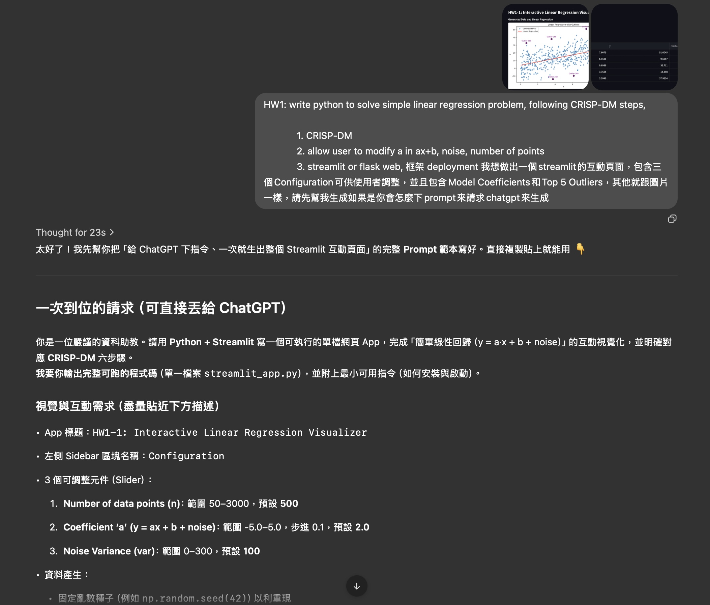
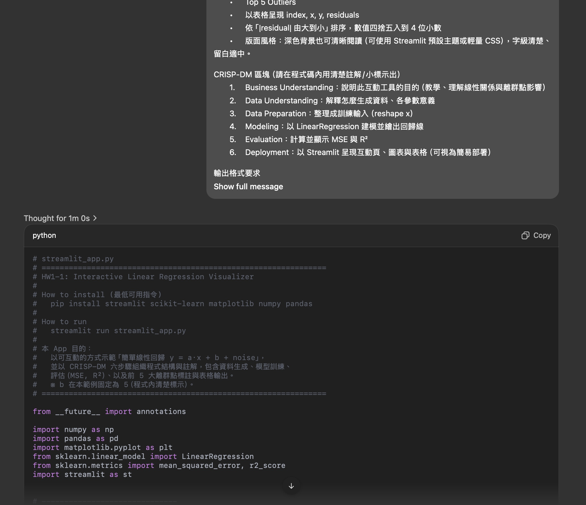
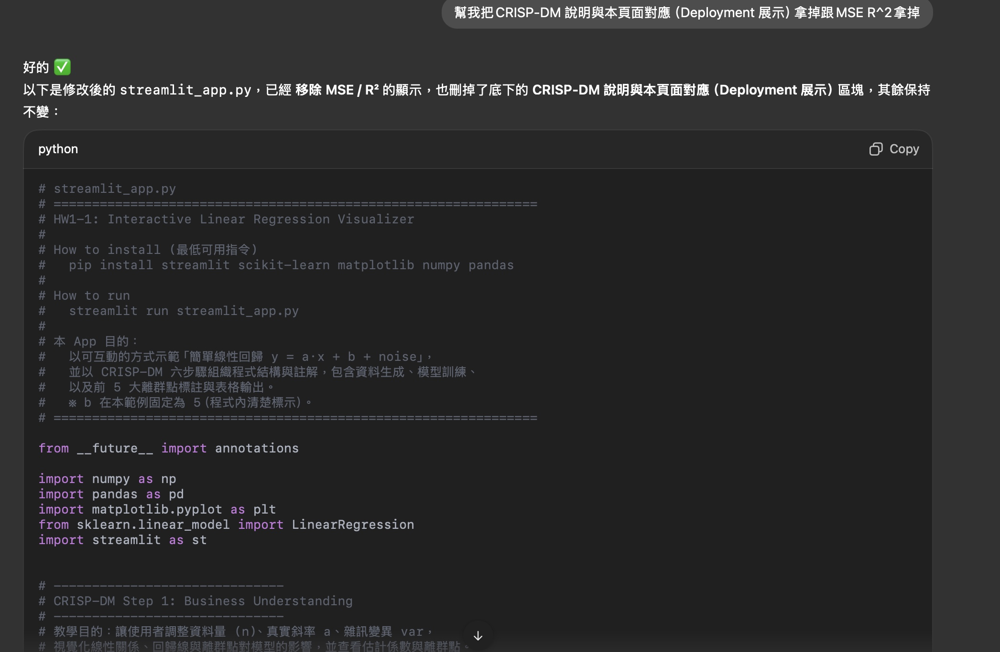

# HW1-1: Interactive Linear Regression Visualizer

這是一個使用 **Streamlit** + **scikit-learn** + **matplotlib** 製作的互動式線性迴歸應用程式。  
使用者可以調整資料點數量、線性模型參數與雜訊大小，並即時查看模型擬合結果與離群點。

---

## 📊 功能特色

- 🎛️ **互動式設定**：透過 sidebar 調整  
  - 資料點數 (n)  
  - 斜率 (a_true)  
  - 雜訊變異數 (var)  

- 📈 **視覺化功能**：  
  - 顯示資料點與擬合的線性回歸線  
  - 標記前 5 個離群點（依殘差大小排序）  

- 📑 **數值輸出**：  
  - 顯示模型係數 (Coefficient a) 與截距 (Intercept b)  
  - 提供離群點表格（包含 index、x、y、residuals）  

---

## 🖼️ Prompt截圖

### 1. 先將問題打給LLM，請他輸出合適的prompt

---

### 2. 執行該prompt

> 上圖：生成所需的code

---

### 3. 調整code之功能

> 上圖：因為有些功能不需要，所以請他移徐

---

